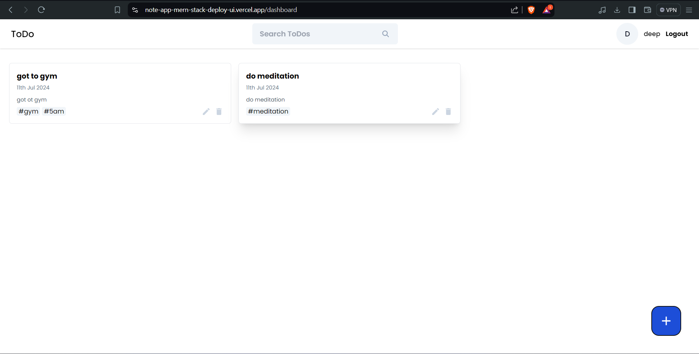

# Note-Taking App

## Overview
This is a feature-rich note-taking application built using the MERN stack (MongoDB, Express.js, React, Node.js). The app allows users to add, edit, and delete notes with a secure user login system.

## Features

### User Authentication
- **Login and Registration:** Users can create accounts and log in to access their personal notes.
- **Secure Access:** Utilizes authentication mechanisms to ensure user data is protected.

### Note Management
- **Add Note:** Users can quickly add new notes with a user-friendly interface and a rich text editor.
- **Edit Note:** Easy editing of existing notes, with version control to revert to previous versions if needed.
- **Delete Note:** Simple deletion of notes with a confirmation prompt to prevent accidental deletions.

## Technology Stack
- **Frontend:** React.js
- **Backend:** Node.js, Express.js
- **Database:** MongoDB
- **Authentication:** JWT (JSON Web Tokens)

## Installation

1. **Clone the repository:**
    ```bash
    git clone https://github.com/deep-pansara/note-app-mern-stack-deploy.git
    ```

2. **Navigate to the project directory:**
    ```bash
    cd note-app-mern-stack-deploy
    ```

3. **Install backend dependencies:**
    ```bash
    cd backend
    npm install
    ```

4. **Install frontend dependencies:**
    ```bash
    cd ../frontend
    npm install
    ```

## Usage

1. **Start the backend server:**
    ```bash
    cd backend
    npm start
    ```

2. **Start the frontend server:**
    ```bash
    cd frontend
    npm start
    ```


## Configuration

- **Backend:** Create a `.env` file in the `backend` directory with the following environment variables:
    ```
    SECRET_ACCESS_TOKEN= "secret key for jwt"
    MONGODB_URL = "your mongodb url"
    ```

- **Frontend:** Modify the `frontend/src/utils/constant.js` to set the backend API URL if needed.

## Contributing

Contributions are welcome! Please open an issue or submit a pull request for any changes or improvements.

## License

This project is licensed under the MIT License - see the [LICENSE](LICENSE) file for details.

## Contact

For any inquiries, please contact pansaradeep@gmail.com.

---

Happy Note-Taking!
